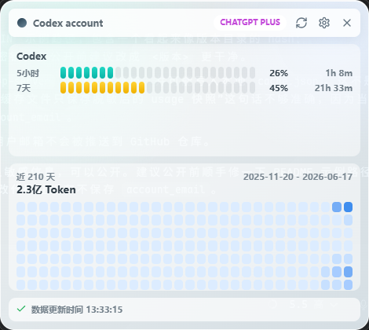

# Codex Usage Tray

适用于 Windows 和 Apple Silicon macOS 的 Codex 用量托盘弹窗。



## 功能

- 托盘常驻，左键点击显示或隐藏弹窗。
- 启动本机 `codex app-server`，通过官方本地协议读取账号、5 小时、7 天、Codex Spark 和 credits 信息。
- 从本地 `~/.codex/sessions` 的 JSONL `token_count` 事件生成近 210 天 heatmap。
- 本地缓存最近一次成功数据，网络失败时显示缓存和错误状态。
- Windows 支持开机启动；macOS 暂不提供开机启动。
- 不读取浏览器 cookie，不做桌面组件，不做多 provider。

## 安全边界

- 不读取 `CODEX_HOME/auth.json` 或用户目录下的 `.codex/auth.json`。
- 不读取、不缓存、不展示 `access_token` 或 `refresh_token`。
- 账号限额由本机 Codex app-server 获取，远端请求由官方 Codex runtime 处理。
- 缓存文件只保存脱敏后的 usage 快照、heatmap 和设置。

## Codex CLI 路径

应用需要能启动：

```text
codex app-server
```

官方 app-server 的默认传输方式是 stdio，因此不需要额外传入 `--listen stdio://`。

### Windows

如果 PowerShell 中运行上述命令提示 `Access is denied` / `アクセスが拒否されました。`，通常是系统解析到了 WindowsApps 包内的 `codex.exe`，该路径不适合第三方程序直接执行。请安装可执行的 Codex CLI，或设置 `CODEX_BIN` 指向可执行的 Codex runtime：

```powershell
[Environment]::SetEnvironmentVariable("CODEX_BIN", "$env:LOCALAPPDATA\OpenAI\Codex\bin\<版本>\codex.exe", "User")
```

`CODEX_BIN` 也可以指向包含 `codex.exe` 的目录。应用会自动扫描 `%LOCALAPPDATA%\OpenAI\Codex\bin\*\codex.exe` 并选择最新 runtime。不要将其指向 `C:\Program Files\WindowsApps\OpenAI.Codex_...\codex.exe`。

### macOS

先在 Terminal 确认 Codex CLI 可用：

```bash
which codex
codex app-server
```

应用启动时会恢复 shell 配置中的 `PATH`，因此从 Finder 启动时也能找到通过 Homebrew、npm 或其他命令行工具安装的 `codex`。如需覆盖自动解析结果，可在应用启动环境中设置 `CODEX_BIN`，其值必须是 Codex CLI 可执行文件的绝对路径。

## Windows 开发与构建

需要 Node.js、Rust、Tauri 的 Windows 系统依赖和 WebView2。

```powershell
npm install
npm run build
npm run tauri:dev
```

构建 Release EXE 和安装包：

```powershell
npm run tauri:build
```

主要产物位于：

- `src-tauri/target/release/win-codex-usage-tray.exe`
- `src-tauri/target/release/bundle/`

Windows Release EXE 使用 GUI 子系统，不显示终端；Debug 构建保留终端以便查看日志。

## Apple Silicon macOS 开发与构建

需要 Apple Silicon Mac、Xcode Command Line Tools、Node.js、Rust 和可用的 Codex CLI。本项目不从 Windows 交叉生成 macOS 应用。

```bash
xcode-select --install
rustup target add aarch64-apple-darwin
npm install
npm run build
npm run tauri:dev
```

构建 ARM64 `.app` 和 `.dmg`：

```bash
npm run tauri:build -- --target aarch64-apple-darwin
```

产物位于 `src-tauri/target/aarch64-apple-darwin/release/bundle/`。当前 macOS 构建用于本机运行，不包含 Developer ID 签名、公证或 Mac App Store 发布配置。

## 许可证

Apache License 2.0
